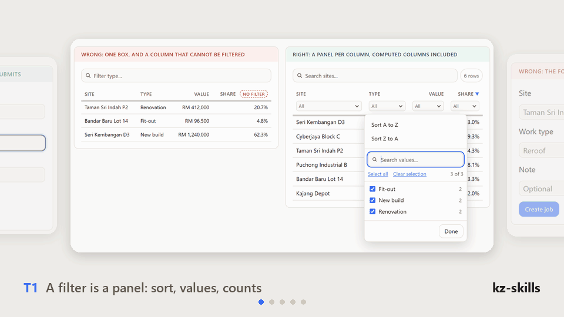
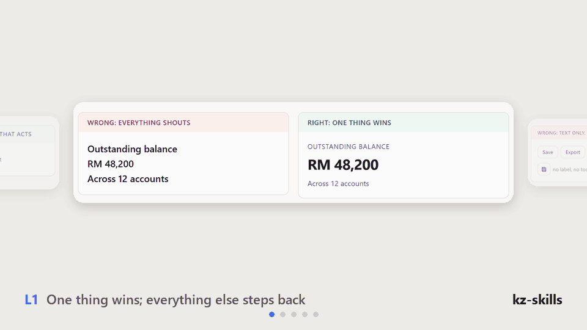
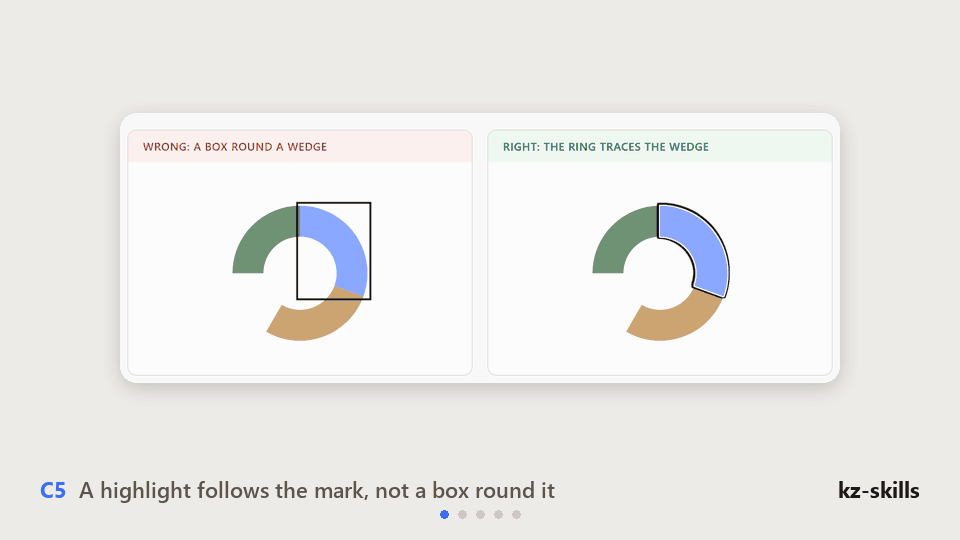

# kz-skills: UI rules for AI coding agents, with checks that measure them

<a href="https://kz-95.github.io/kz-skills/reference/ui-rules-visual.html#t1-filter"></a>

**Stack-neutral UI/UX rules that tell an AI agent what any interface must do, what breaks when it does not, and a browser check that fails it.** 57 UI rules, 21 chart rules, 16 principles, in eight installable skills for Claude Code and any agent that reads Markdown.

[Install](#quick-start) · [Live reference](https://kz-95.github.io/kz-skills/reference/ui-rules-visual.html) · [All 78 rules](docs/rule-index.md) · [For agents: llms.txt](llms.txt) · [Changelog](CHANGELOG.md)

See the rules fail and pass, side by side:
[Table filter](https://kz-95.github.io/kz-skills/reference/ui-rules-visual.html#t1-filter) ·
[Chart selection ring](https://kz-95.github.io/kz-skills/reference/ui-rules-visual.html#c5-ring) ·
[Typing on a phone](https://kz-95.github.io/kz-skills/reference/ui-rules-visual.html#f8-typing) ·
[Label on a plate](https://kz-95.github.io/kz-skills/reference/ui-rules-visual.html#y2-plate) ·
[Every rule](https://kz-95.github.io/kz-skills/reference/ui-rules-visual.html)

---

## Why this exists

AI agents ship the same interface mistakes, confidently, and a screenshot rarely shows them. These five are real, from building this repo:

| What the agent shipped | Rule | The check that fails it |
|---|---|---|
| A filter row that is an **empty typed box under every column**, where a button opening a value list with counts belongs | `T1`, `S1` | `table-check.js` |
| A focus ring that is a **rectangle round a curved chart wedge** | `C5` | `layout-audit.js` (`FOCUS BOX`) |
| A search field that **re-renders on every keystroke**, so the phone keyboard closes after one letter | `F8` | `typing-check.js` |
| A label that is **dark on dark, 1.04:1**, in the dark theme only | `Y2` | `contrast-check.js` (both themes) |
| A filter panel that **only opens**: tap its button again and nothing closes it, and a phone has no Escape | `N2` | `popover-check.js` |

Each rule states the obligation, the failure that follows when it is missed, and the check that catches it. A rule with no check gets broken by the person who wrote it; that happened repeatedly while these were written, and each case is recorded as a habit to have (26 lessons, [Appendix Z](skills/kz-uiuxrule/rules/ui-rules.md)).

## More mistakes agents make

**De-AI: what makes an interface look machine-made**

<a href="https://kz-95.github.io/kz-skills/reference/ui-rules-visual.html#l1-hierarchy"></a>

**Charts**

<a href="https://kz-95.github.io/kz-skills/reference/ui-rules-visual.html#c5-ring"></a>

## What's new in 0.1.0

First public release.

- **Table filters are panels** (`T1`, `S1`). `table-check.js` fails a text-box filter, a column with no filter or sort, and measures (`FILTERGAP`) that the title row and filter row are one header block with a 4px gap.
- **Selection and focus rings follow the shape** (`C5`). Two-tone, so one ring always contrasts with what it overlaps, asserted in both themes.
- **Everything that acts answers the pointer with one halo** (`B4`), never at rest.
- **Typing is never interrupted** (`F8`), with `typing-check.js` for phone width.
- **Number fields** select on entry (`F5`), accept `+ - * /` (`F6`) and state one anchored pattern (`F7`).
- **`UNDEFINED TOKEN`** in the layout audit: a `var(--x)` that nothing defines silently drops its whole declaration.

## What you get

| | | | |
|---|:-:|---|:-:|
| 57 UI rules, each with its failure and its check | ✅ | Works with any stack and any visual style | ✅ |
| 21 chart rules | ✅ | 3 console checks that run on **any** page | ✅ |
| A keyword router: task words to two or three sections | ✅ | Live wrong/right reference page | ✅ |
| Claude Code skills, plugin manifest provided | ✅ | Plain Markdown for GPT, Codex, Cursor and others | ✅ |
| Picks a palette, typeface or framework for you | ❌ | Judges hover and press states from a screenshot | ❌ |

## The eight skills

| Skill | Reach for it when |
|---|---|
| [`kz-skill`](skills/kz-skill/SKILL.md) | A request spans several of these, or it is unclear which applies. The router. |
| [`kz-uiuxrule`](skills/kz-uiuxrule/SKILL.md) | Building, changing or reviewing any UI: the rules, in four modes (adopt, review, build, loop). |
| [`kz-uicheck`](skills/kz-uicheck/SKILL.md) | Before calling UI work done: eight paste-in browser checks that measure instead of judge. |
| [`kz-engrules`](skills/kz-engrules/SKILL.md) | Any code task at all: the engineering floor everything else sits on. |
| [`kz-askcard`](skills/kz-askcard/SKILL.md) | About to ask the user something: three to five decisions, one recommended, a custom option. |
| [`kz-crew021`](skills/kz-crew021/SKILL.md) | A whole project, idea to maintenance, with a costed multi-agent crew. |
| [`kz-reflect`](skills/kz-reflect/SKILL.md) | A mistake was noticed and the fix verified: log it, classify it, and propose the rule or check change for a person to approve. |
| [`kz-loopfix`](skills/kz-loopfix/SKILL.md) | One defect that "fix it and move on" already failed once: critic, fixer, then a gate. |

Plus `ui-glance`, a child of `kz-uiuxrule`: a screenshot reviewed in one pass against a 22-point checklist.

## Quick start

### Claude Code, as a plugin

```
/plugin marketplace add kz-95/kz-skills
/plugin install kz-skills@kz-skills
```

Then `/kz-uiuxrule`, or `/kz-skill` if you are not sure which one.

### Claude Code, by hand

```bash
git clone https://github.com/kz-95/kz-skills.git
cp -r kz-skills/skills/* ~/.claude/skills/
```

On Windows PowerShell: `Copy-Item kz-skills\skills\* $HOME\.claude\skills -Recurse`. Each skill must land as a **direct** child of `skills/`. A skill nested inside another folder is not registered, and will not appear as a command.

### GPT, Codex, Cursor and other agents

The skills are plain Markdown. Point your agent at [`AGENTS.md`](AGENTS.md) and [`llms.txt`](llms.txt), or follow [`docs/install.md`](docs/install.md). The checks are `.js` files you paste into a browser console.

## The rules most often missed

| ID | Rule | Check |
|---|---|---|
| `S1` | Every table ships search, sort on every column and a filter per column. A "filter" is a panel, never a bare text box. | `table-check.js` |
| `T1` | A column filter is a panel: sort, a value list with counts, a range for numbers. | `table-check.js` |
| `F8` | Typing is never interrupted. | `typing-check.js` |
| `F5` | A digit-only field selects its value when it is entered. | `rules-check.js` |
| `F6` | A field that holds an amount accepts the arithmetic that produces it. | `rules-check.js` |
| `C5` | A highlight follows the mark's own outline, never a box round it. | `layout-audit.js` |
| `B4` | Everything that acts answers the pointer, and answers the same way. | `rules-check.js` |
| `Y2` | Text over a variable background needs a contrast decision. | measured |
| `N5` | The mark showing where you are belongs to the thing it marks. | `rules-check.js` |
| `V3` | Verify the layout, not only the behaviour. | `layout-audit.js` |

`rules-check.js` runs against the [reference page](docs/reference/README.md): it proves each right sample passes and each wrong sample still fails. The eight checks in `kz-uicheck` run on any page.

All 78 rules, one line each: [`docs/rule-index.md`](docs/rule-index.md).

## FAQ

**Does it force a visual style?** No. The rules say what must happen, not what it looks like. Where a project has its own design system, the project's rules win.

**My agent still built a text-box filter. Why?** The agent never read `T1`. The line every agent sees is the summary, so the summary now defines the word "filter". If you keep your own always-on instructions, put the same definition there.

**Does it mix with impeccable or another style skill?** Yes: the style skill decides how it looks, `kz-uiuxrule` decides what must happen, and **the rules win where the two conflict**. [`docs/with-impeccable.md`](docs/with-impeccable.md) lists where they agree and the three places they can pull against each other.

**Can I use only the rules, not the crew?** Yes. `kz-uiuxrule` links to `kz-engrules`, `kz-askcard` and `kz-uicheck` as siblings, so install those four together.

**Do the checks need a framework or a build step?** No. Paste a file into the browser console.

**Does it work with GPT?** The skills are Markdown and the hook script is host-neutral, but the hook has only been tested on Claude Code.

## Important notes

- **Pre-release.** The plugin manifest follows the shape of other marketplace plugins, but this repository has not yet been installed from GitHub as a plugin. Manual install is the verified path.
- **The purpose hook is not in the plugin yet.** It asks what a skill is for before it acts. Wire it by hand from [`skills/kz-askcard/hooks/README.md`](skills/kz-askcard/hooks/README.md).
- **Hover, press and focus states need the live page or the checks.** A screenshot is one still.
- **Sample data uses Malaysian ringgit (`RM`).** It is sample data only.

## Repository map

```
skills/        the eight skills, each a direct child
docs/          index, install guide, rule index, live reference page, history
scripts/       build-index.py (generates the rule index), validate.py (CI)
llms.txt       index for LLM crawlers          AGENTS.md  how any agent works here
```

## Contributing

Rule IDs are stable: other people's agents cite them, so never renumber. Every new rule ships with a check that fails when it is broken, and with a wrong/right sample. Run `python scripts/validate.py` before opening a pull request. Commits are authored by the person making them, with no AI co-author lines.

## License

Apache-2.0 with the [Commons Clause](https://commonsclause.com/). See [`LICENSE`](LICENSE).

**You may** use it, change it, and use it in commercial work: build your own products with these rules, use them inside your company, and share your changes.

**You may not** sell it: you cannot charge third parties for the software itself, or for hosting, consulting or support whose value comes substantially from it. The Commons Clause defines "Sell" in the `LICENSE` file; if your case is not obvious, ask first.

This makes it *source-available*, not open source in the OSI sense, so GitHub will not show an "Apache-2.0" badge.
